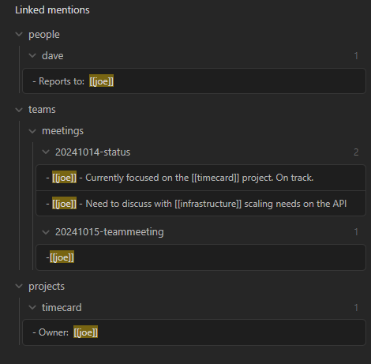
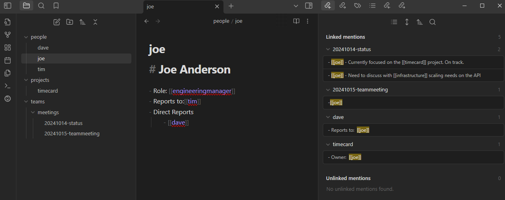

# Hierarchical Backlinks

## Overview
Displays backlinks for the active document as a hierarchy based on the folder structure of the references.

 

## Motivation
In the age old folders vs tags debate I lean heavier on physically organizing notes into high level categories of directories. The tag hierarchy display provides a nice overview of tags and how they relate to each other and I wanted something similar that leveraged the directory structure to display backlinks as a tree.

## Example
Here's a comparison of the core plugin vs the hierarchical backlinks plugin in action.

This is how the out-of-the-box core backlinks plugin displays backlinks:


This is how this plugin displays backlinks:
 

## Features
- Collapsable tree structure allows you to easily focus on what what is most important
- Clickable links to references

## Commands
The following commands are available in the Obsidian Command Palett:

| Command | Description |
|---------|-------------|
| Show hierarchical backlinks | Displays the panel in the event it was closed |

## Development

### Setup
```bash
npm install
```

### Running
```bash
npm run dev
```

<a href="https://www.buymeacoffee.com/jasonmotylinski" target="_blank"></a>